# Pixiv 图片爬取工具(3.3版本)


一款专业级Pixiv图片爬取工具，支持多线程、多进程下载，IP代理自动切换，提供友好的图形用户界面。

## 功能特性

- 🚀 **高效爬取**：支持多线程和多进程并发下载，大幅提升爬取效率
- 🔒 **隐私保护**：内置IP代理自动切换功能，降低封号风险
- 🖼️ **批量下载**：支持通过清单文件批量下载多个作品
- 🎨 **美观UI**：基于PyQt6和FluentWidgets构建的现代化界面
- 🤖 **智能客服**：集成AI客服系统，随时解答使用问题
- ⚙️ **灵活配置**：可自定义线程/进程数、保存路径等参数

## 安装指南

### 前置要求

- Python 3.8+
- Pip 包管理工具

### 安装步骤

1. 克隆仓库或下载源代码：
   ```bash
   git clone https://github.com/yourusername/pixiv-crawler.git
   cd pixiv-crawler
   ```

2. 安装依赖：
   ```bash
   pip install -r requirements.txt
   ```

3. 准备配置文件：
   - 在项目根目录创建 `pixiv_cookies.txt` 文件，填入你的Pixiv登录Cookie
   - (可选) 创建 `pix_list.txt` 文件，填入要批量下载的作品URL，每行一个

## 使用说明

1. **启动程序**：
   ```bash
   python main.py
   ```

2. **主界面功能**：
   - **单作品下载**：输入单个Pixiv作品URL，设置线程数后点击"爬取资源"
   - **批量下载**：编辑`pix_list.txt`文件后点击"爬取清单"
   - **IP设置**：可手动输入或自动获取代理IP
   - **保存路径**：自定义图片保存目录

3. **注意事项**：
   - 使用前请确保已正确配置Cookie
   - 合理设置线程/进程数，过高可能导致封号
   - 建议使用代理IP以降低风险

## 配置选项

- `pixiv_cookies.txt` - 存放Pixiv登录Cookie
- `pix_list.txt` - 批量下载清单文件
- `picture/` - 默认图片保存目录

## 技术架构

```mermaid
graph TD
    A[主窗口] --> B[爬虫功能]
    A --> C[IP代理管理]
    A --> D[AI客服系统]
    B --> E[单作品下载]
    B --> F[批量下载]
    C --> G[手动设置IP]
    C --> H[自动获取IP]
    D --> I[DeepSeek AI集成]
```



## 贡献指南

欢迎提交Pull Request或Issue！贡献前请阅读：

1. Fork项目并创建特性分支
2. 提交清晰的commit信息
3. 确保代码风格一致
4. 更新相关文档

## 许可证

本项目采用 [MIT License](LICENSE)

## 免责声明

本工具仅用于学习交流，请勿用于商业用途或违反Pixiv用户协议的行为。开发者不对滥用造成的后果负责。

## 支持与联系

如有问题，可通过以下方式联系：
- GitHub Issues
- 内置AI客服系统
- Email: lqz090930@qq.com

---

**Happy Crawling!** 🎨✨

以下为软件截图:


